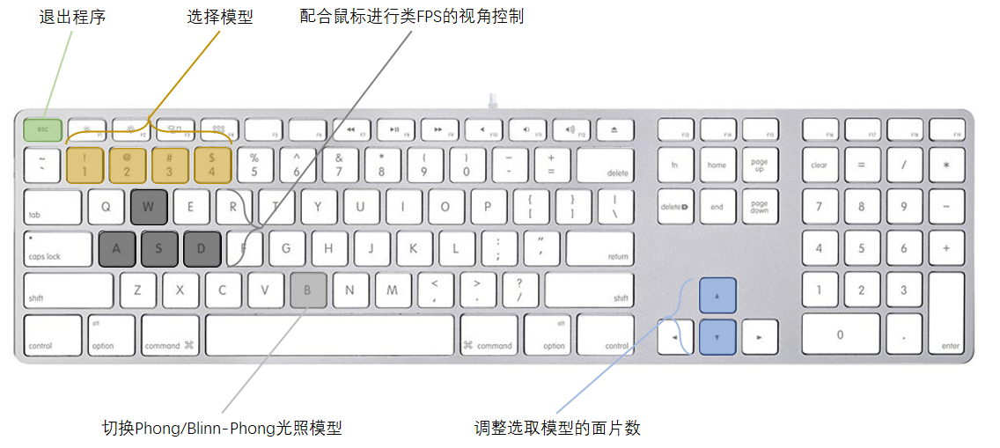

# Final Project Report

## 项目概述

​		本人选取了Project 1的第一个模型作为大作业课题，即实现一个局部光照模型。该项目的主要要求有：

* 包含环境光、漫反射光、镜面高光与阴影的光照模型。
* 透明物体的渲染。
* 多面体与球形物体的渲染，至少需要囊括一个圆柱、一个球体、一个多面体以及一个圆锥体。
* 大于一个光源。

在上述要求的基础上，本人还预期实现下述功能：

* 可调整的物体面片数。
* 可视化的物体选择边框。
* 可切换的光照模型。

## 项目实现

以下分别介绍各部分功能的实现思路。

### 可切换的光照模型

​		本项目使用 opengl+glfw 作为底层框架。**实现光照模型的过程简单来说是将所需要渲染物体的顶点位置、法向等属性发送至图形渲染管线，使用自定义的顶点着色器与片段着色器来分别获得顶点在裁剪空间上的坐标与光栅化后各像素的颜色。**

​		顶点着色器一方面将顶点原始坐标依次进行模型变换、视角变换、投影变换后得到顶点在裁剪空间中的坐标，赋值给内置的变量。另一方面，由于片段着色器中光照的计算是基于法向量与世界坐标进行的，因此顶点着色器也需要将法向信息与仅经过模型变换的中间数据发送至片段着色器。（为了避免模型变换中各向的scale参数不同导致的法向与表面不垂直的情况，需要对法向进行相应修正。）

```c++
#version 330 core
layout (location = 0) in vec3 aPos;
layout (location = 1) in vec3 aNormal;

out vec3 FragPos;
out vec3 Normal;

void main()
{
    FragPos = vec3(model * vec4(aPos, 1.0));
    Normal = mat3(transpose(inverse(model))) * aNormal;
    gl_Position = projection * view * vec4(FragPos, 1.0);
}
```

​		在片段着色器中，可以切换使用 Phong 光照模型或 Blinn-Phong 光照模型来计算片段最终颜色。二者区别在于前者使用反射向量与视角向量来计算高光，后者使用半程向量与法向量计算高光。为了使得渲染效果更为逼真，项目中分别参考了[OpenGL/VRML Materials](http://devernay.free.fr/cours/opengl/materials.html)与[Ogre Wiki](https://wiki.ogre3d.org/tiki-index.php?page=-Point+Light+Attenuation)提供的材质属性与光照衰减参数。

```c++
#version 330 core
out vec4 FragColor;

struct Material {
    vec3 ambient, diffuse, specular;    
    float shininess;
};

struct Light {
    vec3 position, ambient, diffuse, specular;
    float constant, linear, quadratic;
};

in vec3 FragPos;  
in vec3 Normal;

uniform vec3 viewPos;
uniform Material material;
uniform Light light;
uniform bool blinn;

void main()
{
    vec3 norm = normalize(Normal);
    vec3 viewDir = normalize(viewPos - FragPos);
    // ambient
    vec3 ambient = light.ambient * material.ambient;
    // diffuse
    vec3 lightDir = normalize(light.position - FragPos);
    float diff = max(dot(norm, lightDir), 0.0);
    vec3 diffuse = light.diffuse * material.diffuse * diff;
    // specular
    float spec;
    if(blinn)
    {
        vec3 halfwayDir = normalize(lightDir + viewDir);
        spec = pow(max(dot(norm, halfwayDir), 0.0), material.shininess);
    }
    else
    {
        vec3 reflectDir = reflect(-lightDir, norm);
        spec = pow(max(dot(viewDir, reflectDir), 0.0), material.shininess);
    }
    
    vec3 specular = light.specular * material.specular * spec;
    // attenuation
    float distance = length(light.position - FragPos);
    float attenuation = 1.0 / (light.constant + light.linear * distance + light.quadratic * (distance * distance));
    
    vec3 result = ambient + attenuation*(diffuse + specular);

    FragColor = vec4(result, 1.0);
}
```

​		为了实现光照模型的实时切换，绑定按键回调事件，通过B键来在两种光照模型中进行切换。

​		以下分别为仅使用环境光、环境光+漫反射光、环境光+漫反射光+Phong镜面高光、环境光+漫反射光+Phong镜面高光+距离衰减、环境光+漫反射光+Blinn-Phong镜面高光+距离衰减所得到的渲染效果，**通过前三张图的对比可以发现渲染效果逐渐趋于真实。后两张图中，由于仅改变光照模型而未相应修正高光系数，切换至Blinn-Phong模型后，半程向量与法向量夹角余弦值变大，导致Blinn-Phong光照模型所得高光区域面积更大，聚集度更低。**

<center>
        
</center>

### 可交互的多面体与球体建模

​		这一问题有两种解决方案，其一是使用3D建模软件建立所需模型，而后在程序运行时读入并渲染；其二是在程序运行过程中进行实时生成。前一种方案优势在于实时计算量较小，但模型形状无法进行实时改变；后一种方案虽然实时计算量稍大，但胜在模型可交互，且计算量可以接受。综合考量后，本项目采取后一种方案。

​		模型的生成，实际是使用数量足够的三角面片对模型表面进行近似，关键是生成顶点坐标与对应位置的法向量。**由于在后续渲染过程中会用到背面剔除，因此需要对三角面片顶点的定义顺序特别注意，保证每个面片三个顶点定义的时针方向与其法向类似满足右手螺旋定则，即当法向指向屏幕外时，顶点定义顺序应当为逆时针。**

* 圆柱体生成：圆柱体分为三块进行生成，顶面、底面与侧面。其中顶面与底面的生成比较类似，由以两面圆心为顶角的多个等腰三角形面片进行近似，顶面法向统一向上，底面法向统一向下；侧面则可以使用多个矩形进行近似，其中每个矩形由两个直角三角面片构成，为了保证在面数较少时侧面着色的均匀，每个矩形顶点处的法向量定为其所处圆环的圆心指向该顶点方向的单位向量。
* 球体生成：球体基于球坐标系来作为一个整体进行生成，生成过程为一个二层循环，外层循环负责对由顶端至底端的y坐标进行遍历，内层循环同样基于等腰三角面片来对每个y坐标平面与球面相交所形成的圆环进行近似。
* 多面柱体生成：多面柱体生成实际类似于圆柱体生成，唯一的区别在于侧面的法向，多面柱体的侧面法向定义为由侧面中心所处圆环的圆心指向侧面中心方向的单位向量。
* 圆锥生成：圆锥分为底面与侧面进行生成。其中，底面与圆柱体底面的生成相同；侧面由多个以圆锥顶点为顶角的等腰三角形进行近似，同样出于侧面着色连续性考虑，每个等腰三角形的顶角法向定为向上，底角法向定为过底面圆心做底角与顶角连线的垂线的方向的单位向量。

​		分别以线框模式与实际渲染模式展示模型生成结果如下，可以看见模型的生成十分有规律，且效果较为不错。


​		为了实现模型面片数实时可控，绑定按键回调事件，通过数字键1-4依次选择圆柱体、球体、圆锥体以及多面柱体（默认选定圆柱体），选定模型后通过上下方向键实时调整选定模型的面片数（支持点按与长按），渲染循环内检测到模型面片数变动时，会根据当前设定的面片数重新实时生成模型。

​		下图是对相同面数下，圆柱体与多面柱体之间法向差别的图示。**可以看到，由于圆柱体同一面两侧顶点法向不同，内部点法向由插值得到，因此，即便在仅有六个面对侧面进行近似的情况下，其侧面着色效果依旧较为连续，而不像多面柱体，面与面之间存在明显分界线。**


### 基于阴影贴图的多光源实时阴影渲染

​		阴影贴图，即预先从光源视角对场景进行一遍渲染，将该次渲染过程中的深度信息保存为一张贴图，其含义为光源在对应位置上能够看到的最近物体的深度。在实际渲染物体时，需要将片段坐标换算至光源的空间中，对其进行深度检查，若其深度大于贴图对应位置的深度，说明光源无法看到该片段，即该片段应该处于阴影中，此时，需要将由该光源产生的漫反射光分量与镜面高光分量置零。

​		将上述算法进行实现后，得到效果如下所示。


​		上图存在两个主要问题：

* 左下方出现的大量条纹状的阴影失真
* 右上方出现本不应出现的大片阴影

​		第一个问题是由于阴影贴图分辨率有限，导致在距离光源较远的情况下，多个片段可能采样到深度贴图中的同一个值，针对此，可以为深度检测时添加一个较小的偏移量，避免某些片段被错误认为处于阴影中。优化过后效果如下所示，可见阴影失真问题得到了解决。


​		第二个问题是由于在光源视锥远平面以外的部分直接被认为处于阴影中，这才产生了不真实的效果。可以在深度检测最后添加一个判断，对这类点直接视作不在阴影中。优化过后效果如下所示，不应出现的大片阴影消失。


​		在上述优化的基础上，再加入一个新的光源，其位置随时间移动，得到渲染效果如下所示。可以发现，第二个光源的加入使得场景明显变亮，渲染效果也更为逼真。


### 透明物体与物体选择边框

​		本项目基于opengl提供的混合功能，实现了简单的物体透明效果。启用混合功能后，对于alpha小于1的片段，其颜色将由其本身颜色与当前颜色缓冲中的颜色进行混合得到。因而，为了实现较好的渲染效果，透明物体的渲染应当在最后进行。在本项目中，选定红色多面柱体作为透明物体，将其透明度设为0.8，得到的结果如下所示，透明效果的真实感还不错。


​		

​		前述可交互物体建模部分介绍了本项目可以通过数字1-4与上下方向键选择模型进行面片数实时交互控制，然而，仅仅通过键盘数字键进行选择而没有相应反馈，很难判断目前是否选中了所需模型，因此，本项目还参考[知乎问题](https://www.zhihu.com/question/46455089)给出的思路，实现了可视化的物体选择边框。

​		**可视化的物体选择边框实现思路为，首先在启用正面剔除的条件下，将场景中物体的顶点沿其法向进行略微膨胀，并设定为白色，从而渲染得到一个略大的白色物体背面，而后恢复正常的背面剔除，重新渲染一遍正常场景。这样，略大的白色背面主体部分将被遮盖，只剩下膨胀出的边缘部分作为正常场景中物体的边框。**选中各个模型的最终效果如下所示：

<center>
       
</center>

​		值得注意的是，前述“先渲染白色背面，后渲染正常场景”仅仅是从描述的角度出发，其实际上未必需要按照这样的先后顺序进行。只要在渲染相应部分时设定正确的面剔除选项即可。**事实上，当场景中存在依赖渲染顺序的透明物体时，应当将上述过程翻转过来，即先渲染正常场景，而后渲染白色背面作为边框。这样做的原因是，前述渲染透明物体方法是顺序依赖的，若事先渲染白色背面，将导致透明物体渲染时读取到的颜色缓冲将由该背面提供，从而使得透过透明物体只能看到这个白色背面。**一个错误的渲染结果如下图所示。由阴影可以判断，红色透明多面柱体之后应当有一个球体存在，然而由于不正确的渲染顺序，其位置被白色背景抢占，渲染效果失真。


### 键盘交互

​		通过键盘与渲染程序进行交互主要有两种方式：第一种是在渲染循环中嵌入一个单独的函数读取键盘状态，从而在每一帧渲染过程中与键盘进行交互；第二种是直接绑定键盘回调事件，在检测到按键被按下或者释放等操作时才进行交互。由于前一种方式的交互在每一帧都会进行，故适合处理连续的输入事件，如空间移动等；而后者由于回调事件的触发存在内置间隔，故适合处理离散的按键输入，如前述调整光照模型、调整面片数量等。本项目中的交互操作主要通过第二种方式进行。

​		第二种方式中，回调函数的触发动作主要有三种：

* GLFW_PRESS：点按

* GLFW_RELEASE：释放

* GLFW_REPEAT：长按

  

  针对不同的功能需求，按键回调需要进行不同的处理，实现代码如下。

```c++
void key_callback(GLFWwindow *window, int key, int scancode, int action, int mods)
{
    switch (key)
    {
    case GLFW_KEY_ESCAPE:
        glfwSetWindowShouldClose(window, true);
        break;
    case GLFW_KEY_1:
    case GLFW_KEY_2:
    case GLFW_KEY_3:
    case GLFW_KEY_4:
        controlTarget = key - GLFW_KEY_1;
        break;
    case GLFW_KEY_B:
        if(action==GLFW_PRESS)
            blinn=!blinn;
        break;
    case GLFW_KEY_UP:
        if (glfwGetKey(window, GLFW_KEY_UP) == GLFW_PRESS)
            prev_nSegments[controlTarget] = global_nSegments[controlTarget]++;
        break;
    case GLFW_KEY_DOWN:
        if (glfwGetKey(window, GLFW_KEY_DOWN) == GLFW_PRESS)
        {
            if (global_nSegments[controlTarget] > 3)
                prev_nSegments[controlTarget] = global_nSegments[controlTarget]--;
        }
        break;
    default:
        break;
    }
}
```

​		如上所示，数字键1-4的回调函数只要被触发（无论是点按、释放还是长按），就将选定目标变更至按键所代表的模型。

​		对于光照模型切换按键B，需要设定其仅在触发动作为按下时对状态进行变更，否则会出现按下时状态变更但松开时状态又还原的情况。

​		对于调整物体面片数的上下方向键，处理方式又有不同：由于带有曲面的物体面片数一般较高，仅通过离散的单次点按需要较长时间才能对其渲染效果进行显著改变。因此，这里设定，当相应按键回调函数被（点按/释放/长按）触发时，显式检查当前的按键状态，如果是按下的，则将面片数进行一次相应变化。这样的效果是，对于点按事件，该回调函数将对面片数进行一次修改；对于释放事件，此时按键状态不为按下，故不会触发重复修改；而对于长按事件，每次检查结果均为按下，故将对面片数进行连续的修改。至此，本项目中设计的主要按键交互功能均得到完美实现。

​		**至此，本次项目所要求及预期实现的所有主要功能都进行了较为详细的展示，过程中展示的画面均是在程序实时运行的截图，总体效果较为不错。项目中使用openGL进行渲染的主程序流程有一部分借鉴了[LearnOpenGL-CN](https://learnopengl-cn.github.io/)提供的教程及部分源码，同时直接使用了教程中的类FPS摄像机控制以及着色器编译程序两个基础功能头文件。但如前所述，在借鉴框架及部分基础功能的基础上，本项目的代码依旧进行了较大幅度的自主编写以实现更为复杂的多光源阴影、物体模型实时生成、物体可视化选中等功能，且取得了较为不错的效果。**

## 键位图示




## 参考资料

1. [LearnOpenGL-CN](https://learnopengl-cn.github.io/)
2. [OpenGL/VRML Materials (free.fr)](http://devernay.free.fr/cours/opengl/materials.html)
3. [Point Light Attenuation | Ogre Wiki (ogre3d.org)](https://wiki.ogre3d.org/tiki-index.php?page=-Point+Light+Attenuation)
4. [3D 场景中的物体描边效果是怎么做的？ - 知乎 (zhihu.com)](https://www.zhihu.com/question/46455089)

